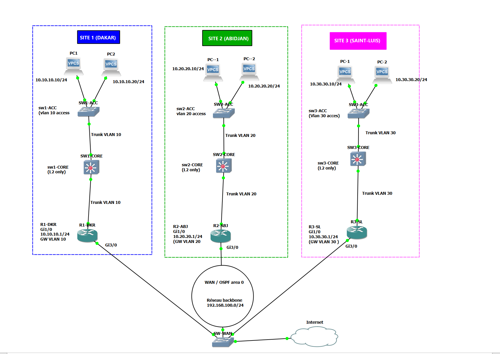
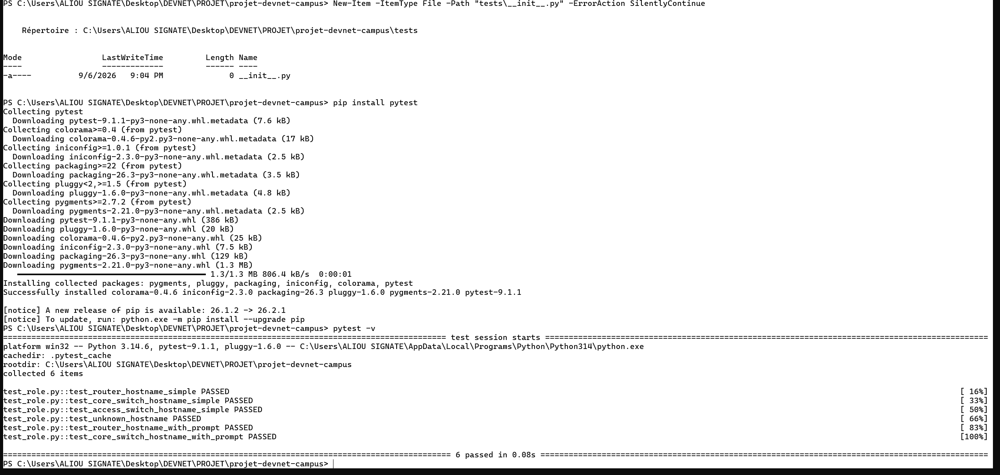
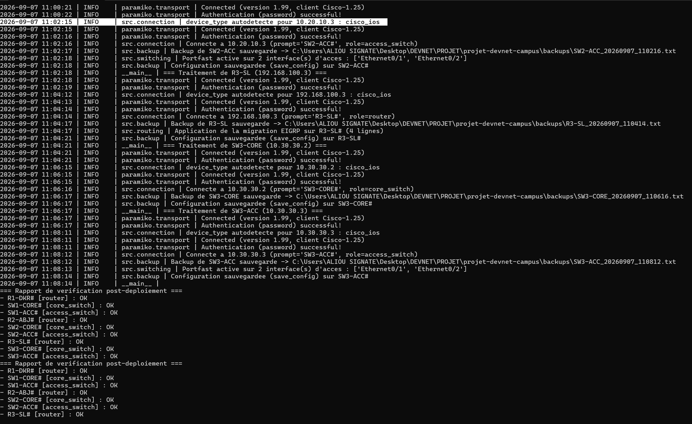
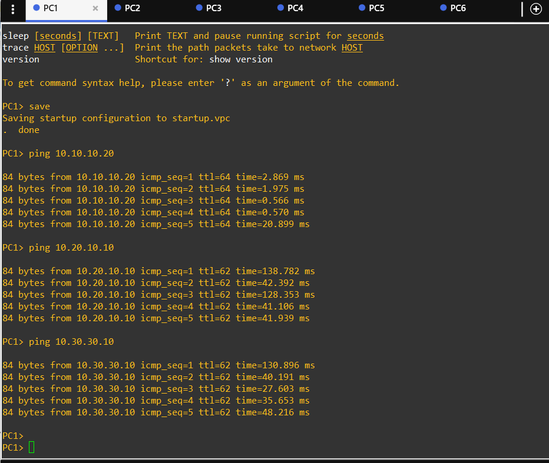
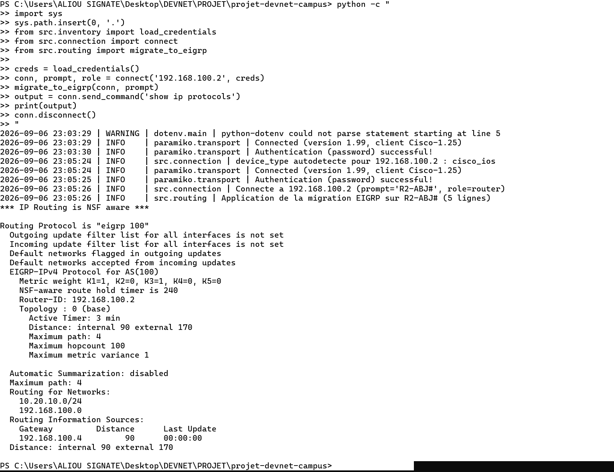

# Projet DevNet — Automatisation réseau campus multi-sites

Outil d'automatisation Python pour un lab Cisco 3 sites (Dakar, Abidjan,
Saint-Louis) : détection automatique des équipements, migration OSPF vers
EIGRP, activation de Spanning Tree portfast sur les ports d'accès, backup
avant modification, et vérification post-déploiement.

Projet réalisé dans le cadre du module Cisco DevNet — Programmabilité &
Automatisation Réseau.

**Auteur** : Aliou Signate

## Architecture du lab

- **3 sites** : Dakar (VLAN 10), Abidjan (VLAN 20), Saint-Louis (VLAN 30)
- **9 équipements** : 3 routeurs (R1-DKR, R2-ABJ, R3-SL), 3 switches cœur
  (SW1/2/3-CORE), 3 switches d'accès (SW1/2/3-ACC)
- **Backbone WAN** : 192.168.100.0/24, reliant les 3 routeurs
- **Simulé sous GNS3** (routeurs c7200, switches IOU L2)

### Topologie réalisée dans GNS3



## Prérequis

- Python 3.10+
- Un lab GNS3 accessible en SSH avec la configuration de management
  uniquement (état "fraîchement réinitialisé")

## Installation

```bash
python -m venv venv
venv\Scripts\activate          # Windows
pip install -r requirements.txt
```

Crée un fichier `.env` à partir du modèle fourni :
```bash
copy .env.example .env
```
Puis édite `.env` avec les vrais identifiants du lab :

NET_USERNAME=admin
NET_PASSWORD=<votre_mot_de_passe>
NET_SECRET=<votre_mot_de_passe>


## Configuration

- `inventory.yaml` : liste tous les équipements par site (nom, IP de
  management, rôle indicatif). Pour ajouter un site, il suffit d'ajouter
  un bloc dans `sites:` — aucune modification de code n'est nécessaire.
- `configs/eigrp/<hostname>.txt` : config IOS externe appliquée lors de
  la migration OSPF → EIGRP, une par routeur.

## Exécution

```bash
python main.py
```

Chaque équipement est traité indépendamment : une erreur de connexion ou
de configuration sur un équipement est journalisée mais n'interrompt pas
le traitement des autres. Un rapport de synthèse est affiché en fin
d'exécution, reflétant l'état réel de chaque équipement.

## Tests

```bash
pytest -v
```

Test automatisé sur `detect_role()`, la fonction de détection de rôle à
partir du hostname réel de l'équipement.

## Structure du projet

projet-devnet-campus/
├── README.md
├── .gitignore
├── .env.example
├── requirements.txt
├── inventory.yaml
├── main.py
├── configs/eigrp/ # config EIGRP externe par routeur
├── src/
│ ├── inventory.py # chargement inventaire + credentials (.env)
│ ├── connection.py # ConnectHandler + SSHDetect (autodetect)
│ ├── role.py # hostname reel -> role (fonction pure, testee)
│ ├── routing.py # migration OSPF -> EIGRP
│ ├── switching.py # spanning-tree portfast (ports d'acces only)
│ ├── backup.py # backup horodate + save_config
│ ├── verify.py # rapport de synthese post-deploiement
│ └── logger.py # logging fichier horodate + console
├── tests/
│ └── test_role.py
├── logs/ # genere a l'execution, ignore par git
└── backups/ # genere a l'execution, ignore par git


## Fonctionnalités implémentées

- [x] Inventaire externalisé en YAML, aucune saisie interactive
- [x] `device_type` toujours déterminé par SSHDetect (autodetect)
- [x] Rôle de chaque équipement déterminé via son hostname réel
      (`find_prompt()`), jamais par IP codée en dur
- [x] Migration OSPF → EIGRP à partir de fichiers de config externes
- [x] Spanning Tree portfast sur les ports d'accès uniquement (jamais
      sur un lien trunk/uplink, garde-fou explicite dans le code)
- [x] Backup horodaté du running-config avant toute modification
- [x] `save_config()` après application des changements
- [x] Gestion d'exceptions complète : un équipement en échec n'empêche
      pas le traitement des autres
- [x] Journalisation dans un fichier horodaté + console
- [x] Aucun secret en clair dans le code (variables d'environnement `.env`)
- [x] Au moins un test automatisé (pytest sur `detect_role()`)
- [x] Historique Git avec plusieurs commits significatifs
## Captures d'écran

### Tests automatisés (pytest)



### Exécution finale de main.py sur les 9 équipements



### Vérification finale — ping inter-sites (PC1 → PC2, PC3, PC5)



### Migration OSPF vers EIGRP (validée sur R2-ABJ)



## Limites connues

- Les interfaces d'accès pour le portfast sont déclarées dans
  `main.py` (`ACCESS_INTERFACES_BY_HOSTNAME`) plutôt que dans
  `inventory.yaml` — à externaliser dans une prochaine itération.
- Pas de rollback automatique en cas d'échec de la migration EIGRP ;
  le backup permet une restauration manuelle si nécessaire.
- L'autodétection SSHDetect prend environ 1 à 2 minutes par équipement
  dans cet environnement virtualisé (GNS3), ce qui rend l'exécution
  complète sur 9 équipements assez longue (~15-20 minutes).

## Vérifications finales

Ping PC1 (10.10.10.10, Dakar) → PC2 (10.10.10.20, Dakar) : succès (5/5)
Ping PC1 → PC3 (10.20.10.10, Abidjan) : succès (5/5)
Ping PC1 → PC5 (10.30.30.10, Saint-Louis) : succès (5/5)

Voir captures d'écran dans le rapport technique joint.